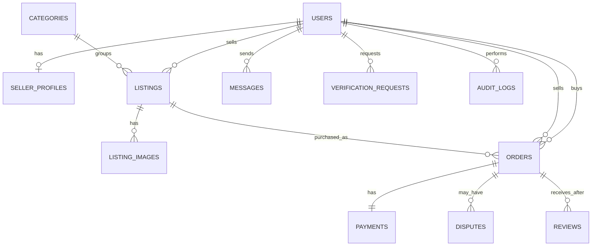
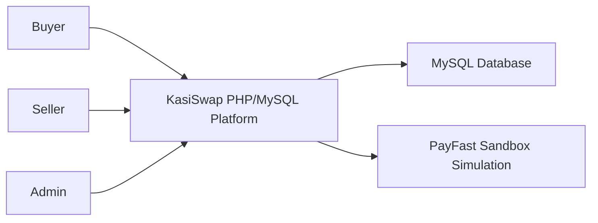
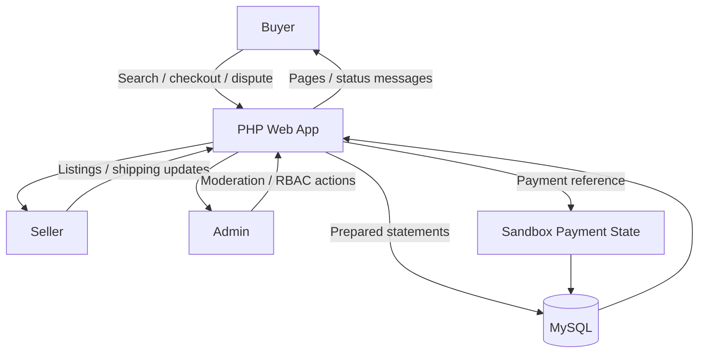
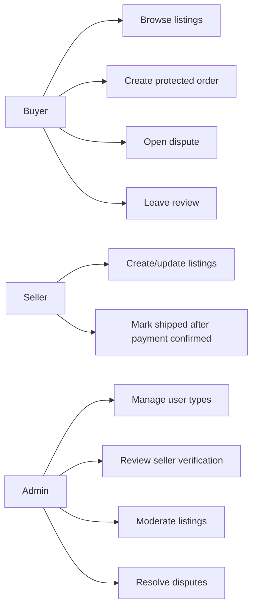

# KasiSwap Deliverable 2 Evidence Pack

## 2.1 Introduction
KasiSwap is a Customer-to-Customer e-commerce prototype for South African township and informal-economy users. It allows buyers and sellers to trade goods through listings, in-app messages, sandbox payment-hold order states, seller verification, reviews, disputes, and an RBAC-protected admin website. The implementation uses PHP, MySQL, HTML, CSS, and JavaScript, matching the module requirements while focusing on low-data pages and practical fraud reduction.

## Needs / Problem Summary
- Township and informal traders need a safer way to buy and sell online without relying only on screenshots, EFT proof, or off-platform chat.
- Mobile-first access and data cost pressure require lightweight pages, compressed images, and minimal JavaScript.
- C2C trust needs visible seller verification, in-app messaging, payment-state control, and admin dispute handling.

## CRC Cards
| Class | Responsibilities | Collaborators |
| --- | --- | --- |
| User | Authenticate, hold role, verification level, profile details | Order, Message, Review, VerificationRequest |
| SellerProfile | Store seller business name, bio, sales count | User, Listing |
| Listing | Describe item, price, location, condition, visibility | Category, ListingImage, Order |
| Order | Track buyer/seller transaction and state machine | User, Listing, Payment, Dispute, Review |
| Payment | Track PayFast sandbox reference and confirmation | Order |
| Dispute | Record issue, status, admin outcome | Order, User, AuditLog |
| Admin | Manage user types, verification, disputes, listings | User, VerificationRequest, AuditLog |

## EERD

## Context Diagram

## Data Flow Diagram

## Use Case Diagram

## Database Design
The SQL schema is implemented in `database/01_schema.sql`. It contains the required user, listing, order, payment, messaging, dispute, review, verification, and audit entities with foreign keys and indexes.

## Screenshot Checklist
### Saved Main Website Screenshots
  - `docs/screenshots/main-marketplace-mobile.png`
  - `docs/screenshots/main-marketplace-tablet.png`
  - `docs/screenshots/main-marketplace-desktop.png`
  - `docs/screenshots/main-listing-detail-desktop.png`
  - `docs/screenshots/main-checkout-desktop.png`
  - `docs/screenshots/buyer-orders-desktop.png`
  - `docs/screenshots/buyer-disputes-desktop.png`
  - `docs/screenshots/buyer-messages-desktop.png`

### Saved Admin Website Screenshots
  - `docs/screenshots/admin-dashboard-mobile.png`
  - `docs/screenshots/admin-dashboard-tablet.png`
  - `docs/screenshots/admin-dashboard-desktop.png`
  - `docs/screenshots/admin-users-desktop.png`
  - `docs/screenshots/admin-verification-desktop.png`
  - `docs/screenshots/admin-listings-desktop.png`
  - `docs/screenshots/admin-disputes-desktop.png`
  - `docs/screenshots/admin-audit-desktop.png`

### Saved MySQL/Adminer Screenshots
  - `docs/screenshots/mysql-adminer-tables-desktop.png`
  - `docs/screenshots/mysql-adminer-users-table-desktop.png`

## Code Evidence Pointers
- PHP: `app/security.php`, `app/services.php`, `public/orders.php`, `public/admin/users.php`
- HTML/PHP templates: `public/index.php`, `public/marketplace.php`
- JavaScript: `public/assets/js/app.js`
- CSS: `public/assets/css/styles.css`
- MySQL: `database/01_schema.sql`, `database/02_seed.sql`

See `docs/code-samples.md` for ready-to-paste snippets and short explanations.

## Live Deployment Evidence
The assignment requires a live hosted website, not localhost. KasiSwap is currently deployed on InfinityFree:

- Live website URL: `https://kasiswap.free.nf/`
- GitHub repository URL: `https://github.com/jnehohwa/kasiswap-php-mysql-deliverable-2`
- Live-hosted screenshots can be captured from this domain if the lecturer requires screenshots from the hosted site rather than local Docker.

This hosting choice fits the project because the app intentionally uses PHP and MySQL for rubric compliance.

## Test Scenarios
- Login with buyer, seller, and admin seeded accounts.
- Buyer browses listings, creates an order, confirms sandbox payment, marks delivered, releases funds, and reviews seller.
- Seller creates/updates a listing and can mark shipped only after payment is confirmed.
- Buyer opens a dispute for an active protected order.
- Admin creates/updates/deletes user types, approves verification, moderates listings, resolves disputes, and reviews audit logs.
- Confirm direct access to `/admin/*` is blocked for non-admin users.
- Confirm CSRF-protected POST forms reject missing tokens.
